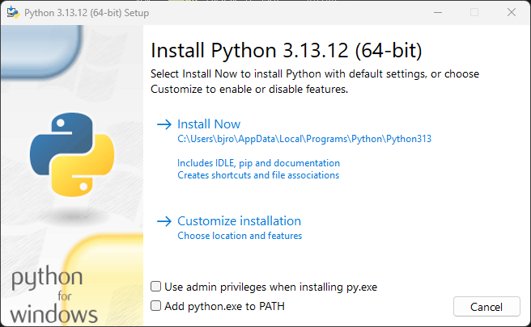
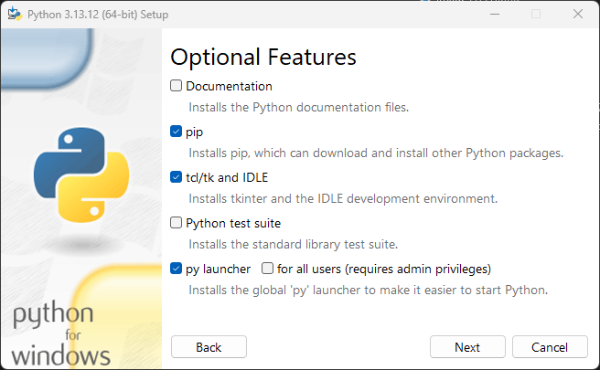
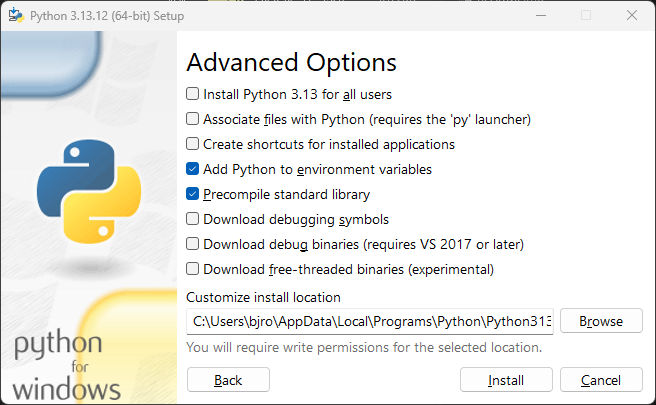
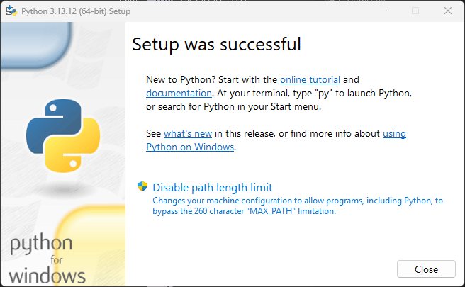
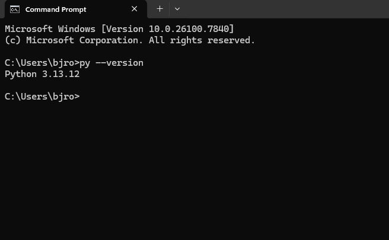

Quick Setup (Recommended for End Users)
---------------------------------------

### 1) Download the Project

* Download the ZIP release from GitHub (or optionally clone the repository). Make sure to also get the attached installer for Python 3.13 if you have not already installed Python 3.13.

* **Place the folder in a logical location**, e.g., `C:\Users\<YourUser>\Documents\OregonProcessing`.

  > The location will be used for the virtual environment and scripts, so choose a place that you can keep permanently.

### 2) Install Python 3.13

* Use the official Python 3.13 installer provided in the release.

* **Instructions for installing Python 3.13** are detailed in the Python 3.13 Installer Instructions section below.

### 3) Run the Setup Script

1. Navigate to the project folder using FileExplorer and double click on setup.bat to run it.

2. Run the setup batch file:

`setup.bat`

* This will:

  1. Detect Python 3.13 via the official Python launcher (`py.exe`)

  2. Create a virtual environment in the project folder (`venv`)

  3. Install the Oregon Processing package and dependencies into the virtual environment

### 4) Test the Scripts

* User-facing shortcuts are located in the `bin` folder.

* Run any script, e.g.:

`bin\open_terminal.bat`

* Most scripts require an Oregon RFID reader to function, but simply running them will indicate that the setup worked.

* * *

Python 3.13 Installer Instructions
----------------------------------

The Python installer is included in the release. Follow these steps to install it **without requiring admin privileges**:

### Page 1: Choose Installation mode
* Use admin privileges while installing py.exe: ❌ Unchecked
* Add python.exe to PATH:  ❌ Unchecked

**Click on Customize installation**

### Page 2: Optional Features

* Documentation: ❌ Unchecked

* PIP: ✅ Checked

* Tcl/Tk and IDLE: ❌ Unchecked

* Python test suite: ❌ Unchecked

* PyLauncher: ✅ Checked (install just for this user)

**Click on Next**

* * *

### Page 2: Advanced Options

* Install Python 3.13 for all users: ❌ Unchecked

* Associate files with Python: ❌ Unchecked

* Create shortcuts for installed applications: ❌ Unchecked

* Add Python to environment variables: ✅ Checked

* Precompile standard library: ✅ Checked

* Download debugging symbols: ❌ Unchecked

* Download debug binaries: ❌ Unchecked

* Download free-threaded binaries: ❌ Unchecked

* Install location: `%LOCALAPPDATA%\Programs\Python\Python 3.13` (default is fine)

**Click on Install**.

* * *

### Page 3: Complete the Install

* Wait for the installation to finish. Then close the installer.

* (Optional) Verify installation by opening a Command Prompt and running:

`py --version`

* You should see `Python 3.13.x` displayed.

* * *

Project Layout
--------------

* `src/oregon_processing/` – package source (import as `oregon_processing`)

* `bin/` – user-facing shortcuts (double-click to run)

* `tools/` – internal batch files and utilities

* `venv/` – virtual environment (created by `setup.bat`)

* * *

Troubleshooting
---------------

* **Python launcher not found**: Ensure you installed Python 3.13 using the official installer provided in the release.

* * *

License
-------

MIT